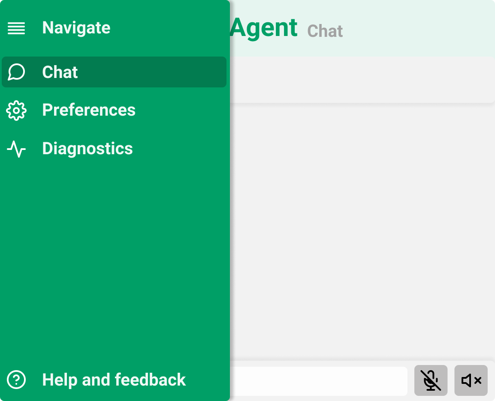
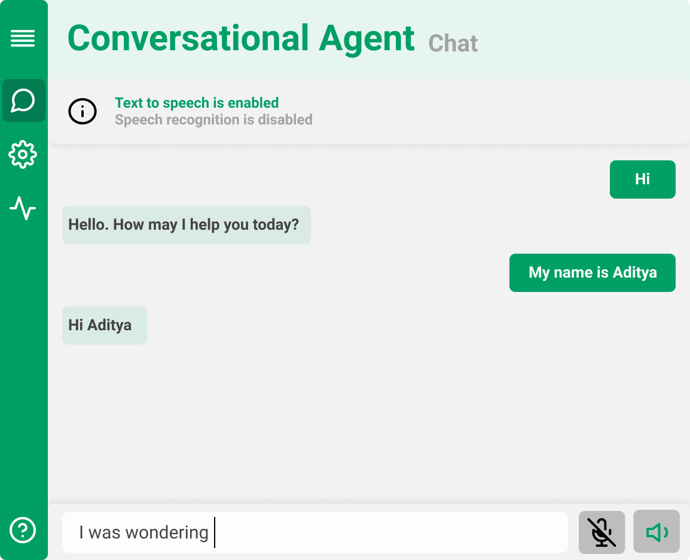

# Coming up with a plan

It was important to get a perspective on everything I had to do, and plan my days. Plans very often don't pan out the way they're supposed to, and there are a lot of reasons for this. But plan always better than no plan.

## Look and feel

My project title is **Graphical user interface for affective human-robot interactions**.

So needless to say, it needed to look good. I decided to take a path that was clean, bold and intuitive. Creativity is important, but it might not always guarantee intuition. I took inspiration from popular applications that implement similar features.

It is a little hard to nail a design to the last pixel before the project even begins. Because a lot of things change as we progress, and some aspects might not look exactly the way they look in design (CSS is a little finicky that way).

But I tried to get it as close to the final thing as possible, by spending more time brainstorming. I've worked on some projects in the past, where we focused only on functionality, and as we added more features, it started becoming more and more unusable (from a design perspective).

#### Basics

For a  clean design, I tried to focus on consistency. 

- Each page has the exact same structure - navigation, title, sub-title, content, actions. 
- All related UI elements have the exact same colour, size, margin and padding. 
- Text font faces, sizes and colours for titles, subtitles, labels and content are pre-defined.
- Single primary colour. The pastel green of this app was inspired from Robocomp's logo. 
- Straightforward transitions that cue the user on state changes.

Writing good CSS will definitely take care of the basics.

#### Navigation

The application combines four independent windows. All four windows are nearly equally important. I chose to implement a **collapsible side navigation** like the one we see in VS Code.

- Since this application is meant for desktop use, most desktops have enough horizontal space to house a side navigation bar. 

- It is extensible. Adding more options is a breeze, and hardly affects other components. No wonder a lot of admin panels use it.
- Provides one click access to any section of the app.
- Bold and intuitive - It is always on the screen, in the state user chooses to keep it in. Once the user learns the 4 icons on the bar, navigation couldn't be faster.

Fig: Expanded navigation bar

Fig: Collapsed navigation bar

#### Chat

